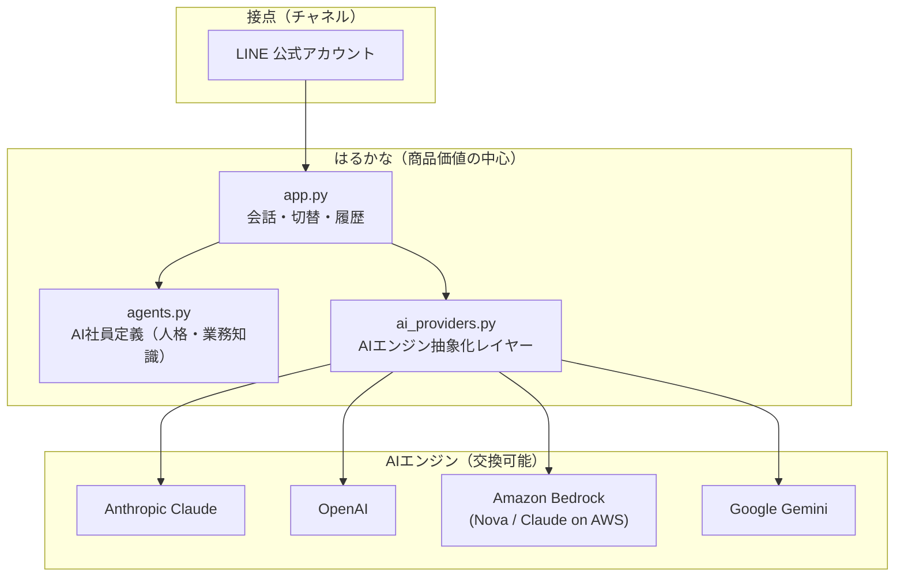

# はるかな マルチAI基盤 構成

はるかなは「Claude で作ったAI」ではなく、**建築設計事務所・工務店向けのAI業務基盤**です。
その下のAIエンジンは交換可能で、顧客の既存IT環境に合わせて選べます。

## 1. 構成図



### レイヤーの役割

| レイヤー | ファイル | 中身 | 商品価値 |
|---|---|---|---|
| 接点 | `app.py` の webhook | LINE の送受信 | 低（置き換え可能） |
| 業務ロジック | `app.py` | 担当切替・会話履歴・コマンド | 中 |
| **AI社員定義** | `agents.py` / `HARUKANA_AGENTS_JSON` | 人格・業務知識・テンプレート | **高（ここが商品）** |
| エンジン抽象化 | `ai_providers.py` | 各社SDKの差を吸収 | 中（他社が真似しにくい運用資産） |
| AIエンジン | 各社SDK | モデルそのもの | 低（コモディティ・交換可能） |

AIモデルは数か月で入れ替わります。売り物にすべきは **建築業務のノウハウ・テンプレート・
データ構造・エージェント設計** であり、モデルは差し替え可能な部品として扱います。

## 2. エンジンの切り替え方

環境変数 1 つで切り替わります。

```bash
AI_PROVIDER=anthropic   # anthropic | openai | bedrock | gemini
```

各エンジンに必要な設定：

| AI_PROVIDER | 必要な環境変数 | モデルIDの例 | pip |
|---|---|---|---|
| `anthropic` | `ANTHROPIC_API_KEY`（`ANTHROPIC_MODEL` は任意） | `claude-sonnet-4-6` / `claude-opus-5` | `anthropic` |
| `openai` | `OPENAI_API_KEY` + `OPENAI_MODEL`（`OPENAI_BASE_URL` は任意） | OpenAI のモデル一覧を参照 | `openai` |
| `bedrock` | AWS 認証情報 + `BEDROCK_MODEL`（`AWS_REGION` 既定 `ap-northeast-1`） | `apac.amazon.nova-pro-v1:0` / `apac.anthropic.claude-...` | `boto3` |
| `gemini` | `GEMINI_API_KEY` + `GEMINI_MODEL` | Google AI Studio のモデル一覧を参照 | `google-genai` |

> `anthropic` 以外はモデルIDの明示指定を必須にしています。モデル名は各社で頻繁に
> 改廃されるため、コードに古いIDを埋め込んで沈黙して壊れるより、設定時に
> エラーで気づける方が安全なためです。

LINE からも切り替えられます（デモ・検証用）。

```
エンジン              → 現在の基盤と選択肢を表示
エンジン:openai       → この利用者の応答を OpenAI に切り替え
```

優先順位は **利用者の切替 > AI社員ごとの指定（`provider`）> `AI_PROVIDER`** です。
AI社員ごとに基盤を変えられるので、「現場写真は Bedrock、経営相談は Claude」という
混在構成も取れます。

## 3. 顧客への売り分け

| 顧客の状況 | 提案する基盤 | 提案トーク |
|---|---|---|
| すでに AWS を利用（社内システム・データがAWS） | Amazon Bedrock | 「データはAWSから出しません。今の環境の中にAI社員を置けます」 |
| ChatGPT を業務利用中・OpenAI に慣れている | OpenAI | 「今お使いの ChatGPT と同じ頭脳を、建築業務の形にして納品します」 |
| Google Workspace 中心 | Gemini | 「Drive・Gmail と同じ Google 環境で完結します」 |
| こだわりなし／文書作成と長文処理が中心 | Anthropic Claude | 「長い仕様書・議事録の読み込みに強い基盤を標準にしています」 |
| 情報システム部門が厳しい・複数見積が必要 | 複数基盤を提示 | 「基盤は後から変更できます。ロックインしません」 |

営業上の言い方は「Claudeを導入します」ではなく
**「御社の環境に合わせて最適なAI基盤を選びます」**。
基盤を選べること自体が、はるかなの差別化になります。

## 4. 新しい基盤を追加する手順

`ai_providers.py` に `AIProvider` を継承したクラスを 1 つ足すだけです。

```python
class NewProvider(AIProvider):
    key = "new"
    label = "新しい基盤"
    model_env = "NEW_MODEL"
    package = "new-sdk"

    def _build_client(self):
        sdk = self._import("new_sdk")
        return sdk.Client(api_key=self._env("NEW_API_KEY"))

    def generate(self, system, messages, max_tokens):
        ...
        return "応答テキスト"
```

`PROVIDERS` の生成対象に追加すれば、`AI_PROVIDER=new` で使えるようになります。
SDK は遅延 import しているため、使わない基盤の SDK をインストールする必要はありません。

## 5. 顧客ごとのAI社員定義

AI社員はコードから切り離してあり、顧客ごとに差し替えられます。

```bash
HARUKANA_AGENTS_FILE=/etc/harukana/agents.json
# または
HARUKANA_AGENTS_JSON='{"default":"はるか","agents":{...}}'
```

書式は `examples/agents.sample.json` を参照してください。
基盤（`provider` / `model`）は AI社員単位でも指定できます。
